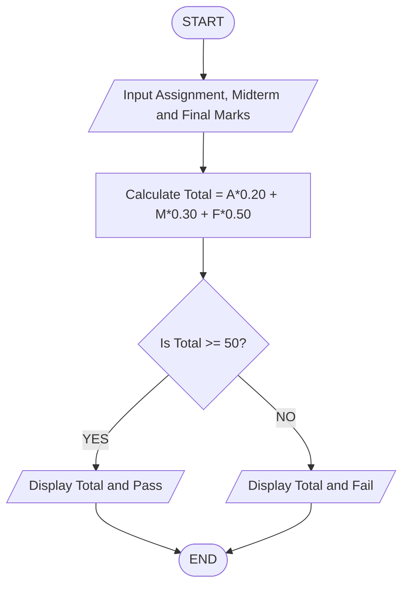
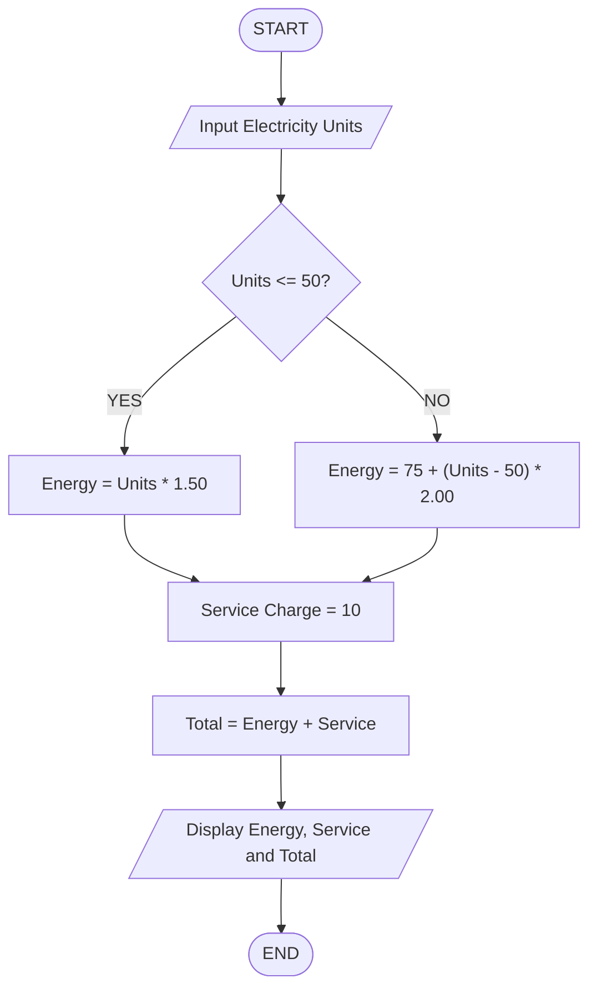
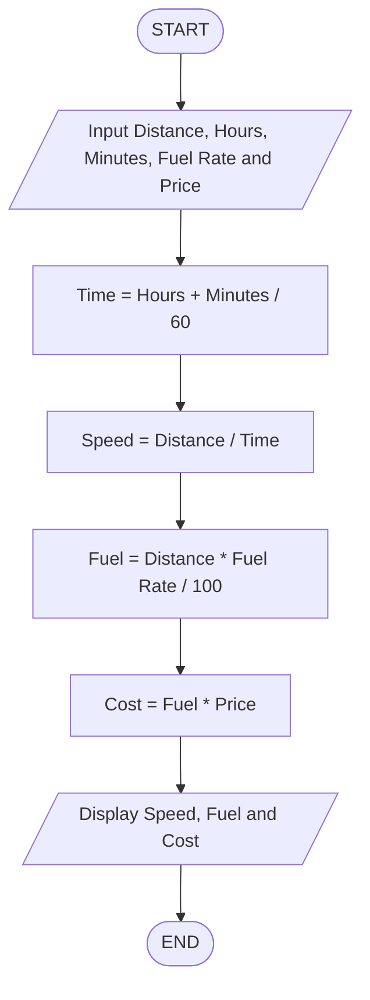

# PROGRAMMING FUNDAMENTALS ASSIGNMENT

## TASK 1: STUDENT COURSE TOTAL

### Flowchart

```mermaid
flowchart TD
    A([START]) --> B[/Input Assignment, Midterm and Final Marks/]
    B --> C[Calculate Total = A*0.20 + M*0.30 + F*0.50]
    C --> D{Is Total >= 50?}
    D -->|YES| E[/Display Total and Pass/]
    D -->|NO| F[/Display Total and Fail/]
    E --> G([END])
    F --> G
```

## TASK 2: ELECTRICITY BILL

### Flowchart

```mermaid
flowchart TD
    A([START]) --> B[/Input Electricity Units/]
    B --> C{Units <= 50?}
    C -->|YES| D["Energy = Units * 1.50"]
    C -->|NO| E["Energy = 75 + (Units - 50) * 2.00"]
    D --> F["Service Charge = 10"]
    E --> F
    F --> G["Total = Energy + Service"]
    G --> H[/Display Energy, Service and Total/]
    H --> I([END])
```

## TASK 3: TRIP SPEED AND FUEL COST

### Flowchart

```mermaid
flowchart TD
    A([START]) --> B[/Input Distance, Hours, Minutes, Fuel Rate and Price/]
    B --> C[Time = Hours + Minutes / 60]
    C --> D[Speed = Distance / Time]
    D --> E[Fuel = Distance * Fuel Rate / 100]
    E --> F[Cost = Fuel * Price]
    F --> G[/Display Speed, Fuel and Cost/]
    G --> H([END])
```
