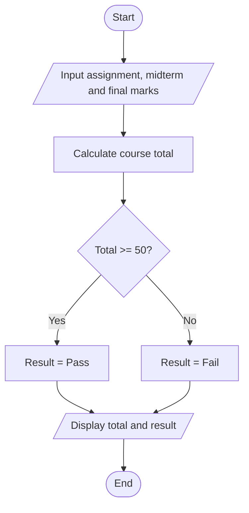
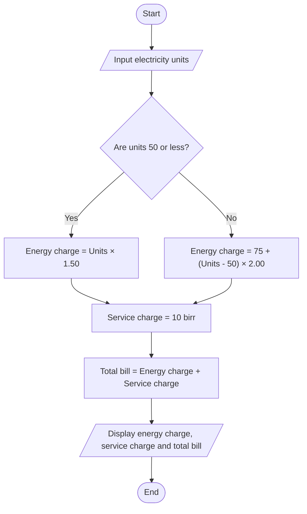
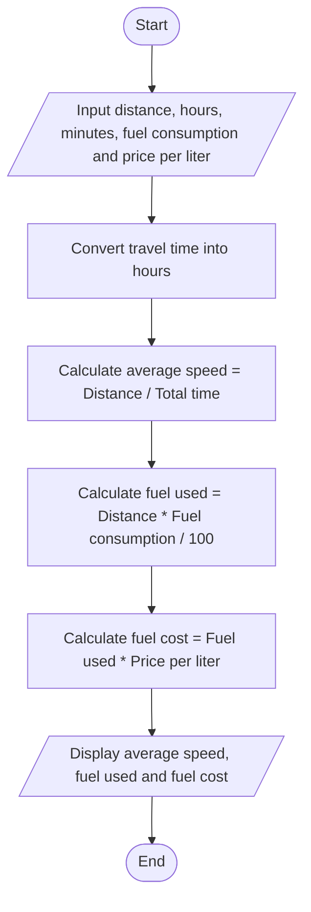

## Task 1: Student Course Total
### Flowchart

```mermaid
flowchart TD
    A([Start]) --> B[/Input assignment, midterm and final marks/]
    B --> C[Calculate course total]
    C --> D{Total >= 50?}
    D -->|Yes| E[Result = Pass]
    D -->|No| F[Result = Fail]
    E --> G[/Display total and result/]
    F --> G
    G --> H([End])
```

## Task 2: Electricity Bill

### Flowchart

```mermaid
flowchart TD
    A([Start]) --> B[/Input electricity units/]
    B --> C{"Are units 50 or less?"}
    C -->|Yes| D["Energy charge = Units × 1.50"]
    C -->|No| E["Energy charge = 75 + (Units - 50) × 2.00"]
    D --> F["Service charge = 10 birr"]
    E --> F
    F --> G["Total bill = Energy charge + Service charge"]
    G --> H[/Display energy charge, service charge and total bill/]
    H --> I([End])
```

## Task 3: Trip Speed and Fuel Cost

### Flowchart

```mermaid
flowchart TD
    A([Start]) --> B[/Input distance, hours, minutes, fuel consumption and price per liter/]
    B --> C[Convert travel time into hours]
    C --> D[Calculate average speed = Distance / Total time]
    D --> E[Calculate fuel used = Distance * Fuel consumption / 100]
    E --> F[Calculate fuel cost = Fuel used * Price per liter]
    F --> G[/Display average speed, fuel used and fuel cost/]
    G --> H([End])
```
